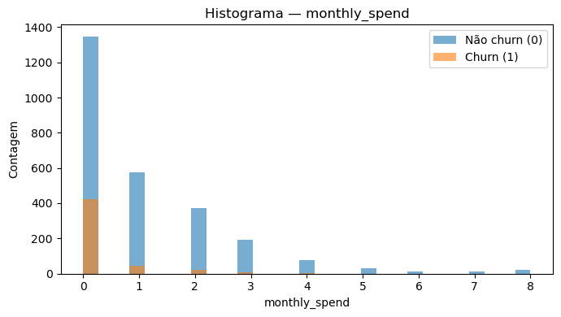
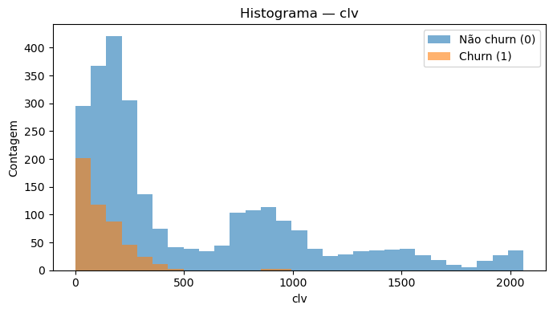
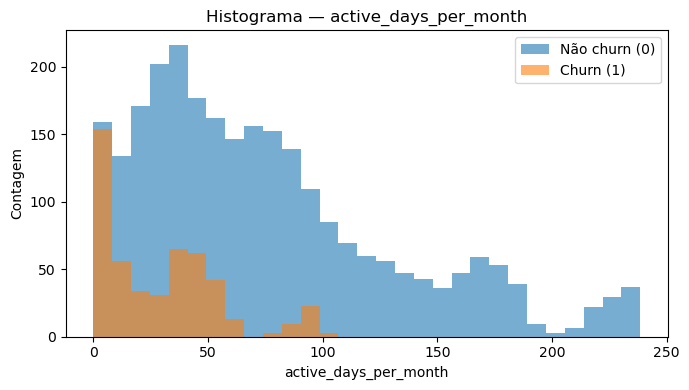
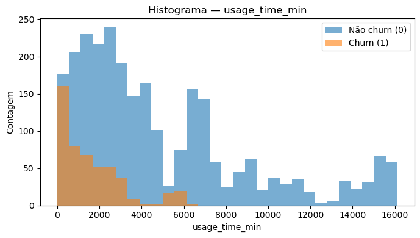
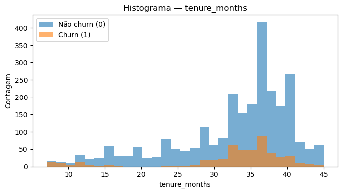
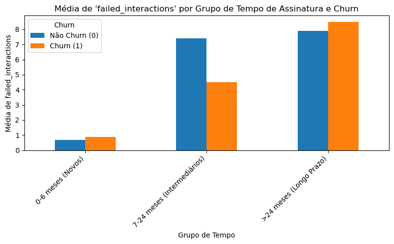

# Introdução
Este projeto é uma análise de dados completa para a prevenção de churn. A partir de um dataset de telecom, foi construído um modelo preditivo capaz de identificar clientes em risco e fornecer insights acionáveis para as equipes de CX e CS.

# Resumo do problema & Objetivos da análise.
Temos como objetivo compreender os principais fatores que influenciam o churn e desenvolver um modelo preditivo interpretável capaz de estimar a probabilidade de cancelamento a partir de variáveis históricas e comportamentais.A base de dados utilizada é proveniente de uma empresa de telecomunicações iraniana, disponibilizada publicamente na comunidade de Machine Learning Kaggle para fins de experimentação e estudo, sendo amplamente utilizada em grupos de análise de dados e machine learning para testes e demonstrações de metodologias analíticas.

# Descrição do dataset (origem, variáveis, limitações).
O dataset tem origem do site Kaggle (https://www.kaggle.com/datasets/alinoranianesfahani/iranian-churn-dataset) 
Após o processo de limpeza, foi realizado uma "atualização" nas nomenclaturas de algumas colunas do dataset para que melhor refletisse a realidade atual das telecoms, resultando no dataset (telecom_churn_clean.csv).

### Mapeamento de variáveis (nomes originais → nomes padronizados)

| Variável original       | Variável padronizada     | Observação                          |
|-------------------------|--------------------------|-------------------------------------|
| Call Failure            | failed_interactions      |                                     |
| Complains               | support_complaints       |                                     |
| Subscription Length     | tenure_months            |                                     |
| Charge Amount           | monthly_spend            |                                     |
| Seconds of Use          | usage_time_min           | Conversão de segundos → minutos     |
| Frequency of use        | active_days_per_month    |                                     |
| Frequency of SMS        | app_notifications_freq   |                                     |
| Distinct Called Numbers | unique_interactions      |                                     |
| Age Group               | age_group                |                                     |
| Tariff Plan             | plan_type                |                                     |
| Status                  | subscription_status      |                                     |
| Age                     | customer_age             |                                     |
| Customer Value          | clv                      | Customer Lifetime Value (CLV)       |
| Churn                   | churn                    | Variável target                     |

# Processo de limpeza.

- Importação de bibliotecas (pandas, numpy).

- Leitura do CSV e padronização das colunas.

- Mapeamento e renomeação de colunas para nomes mais claros.

- Conversão de tipos de dados (por exemplo, segundos para minutos).

- Tratamento de colunas categóricas e criação de grupos etários.

- Sanity Check e exportação da versão final do dataset.

# Requirements

- pandas

- numpy

- matplotlib

- seaborn

- scikit-learn

- graphviz

- pydotplus

# Principais análises.
CHURN SILENCIOSO: Churn acontece ao longo de falhas de interações, porém ainda apresenta um pico significativo logo no início onde ainda não há interação, demonstrando um "churn silencioso".

CLIENTES DE BAIXO VALOR: Nos dois gráficos abaixo podemos observar que o churn ocorre mais com Clientes de baixo valor para o negócio.

BAIXO ENGAJAMENTO: Além de não registrarem (failed_interactions), a maioria dos clientes "churners" também se concentram entre os menos ativos.

CLISE DE FIDELIDADE: A descoberta mais grave da análise exploratória foi o grande volume de churn concentrado em clientes de longo prazo, algo que até então parecia ser um problema reservado a novos clientes. Essa informação é mais preocupante pois sugere uma possível erosão do valor do produto, algo para ser investigado com muita atenção.

# Modelos aplicados (regressão & árvore).
REGRESSÃO LOGÍSTICA: O primeiro modelo que realizamos na análise foi o da regressão logística e com dois reajustes para refinamento, ele passou a apresentar os resultados abaixo.

=== Métricas — Modelo Refinado (LogReg) ===

Accuracy : 0.901

A acurácia mostra a performance geral do modelo, ou seja, a porcentagem de previsões que ele acertou no total. Um valor de 90% é um ótimo positivo para a previsão.

Precision: 0.81

A precisão responde à pergunta: "Dos clientes que o modelo previu como Churn, quantos realmente deram churn?". Um valor de 81% é sólido e significa que, para cada 10 clientes sinalizados como de risco, cerca de 7 realmente estão em alto risco.

Recall   : 0.478

O recall responde à pergunta: "De todos os clientes que realmente deram churn, quantos o modelo conseguiu identificar?". Um recall de 48% indica que o modelo é capaz de "pegar" a maioria dos clientes que estão prestes a cancelar.

AUC-ROC  : 0.935

A área sob a curva (AUC-ROC) é uma das melhores métricas para avaliar modelos de classificação. Um valor de 0.935 (em uma escala de 0 a 1) mostra que o modelo é muito bom em distinguir entre clientes de churn e não-churn, superando em muito a aleatoriedade.

F1-score : 0.601

O F1-score sinaliza o balanço entre precisão e recall em um único número. Um F1-score de 0.601 mostra um bom balanço, indicando que o modelo é confiável tanto para identificar clientes em risco quanto para evitar falsos alarmes.

---

ARVORE DE DECISÕES: Rodamos uma segunda opção de modelo para comparar performance entre os dois, e por fim, optamos pela arvore de decisões uma vez que o modelo de regressão falha em identificar um número muito grande de clientes em risco (Recall 48%). A Árvore de Decisão, por outro lado, nos permite capturar a maior quantidade de clientes que realmente darão churn (Recall 61%), garantindo que o time de Sucesso do Cliente possa intervir onde realmente importa.

Precision: 0.81

Recall   : 0.61

F1-score : 0.69

### Comparação entre modelos

| Modelo              | Acurácia | Precisão | Recall | F1-score | AUC-ROC |
|---------------------|----------|----------|--------|----------|---------|
| Regressão Logística | 90%      | 81%      | 48%    | 0.60     | 0.93    |
| Árvore de Decisão   | 85%      | 81%      | 61%    | 0.69     | -       |

# Conclusão + recomendações práticas.

O projeto de análise e modelagem de churn transformou um desafio de negócio em uma oportunidade estratégica para a empresa. Por meio de uma análise exploratória completa, identificamos os principais fatores que influenciam o cancelamento de clientes, como o baixo engajamento e a "crise de fidelidade" entre clientes de longa data.

A modelagem preditiva com a Árvore de Decisão validou esses insights e forneceu um mapa de risco claro, traduzindo a matemática em regras de negócio acionáveis. Já a Regressão Logística se mostrou útil como baseline comparativo, gerando um score probabilístico contínuo que complementa a visão da árvore. Em conjunto, os dois modelos cumprem papéis distintos e complementares: a Regressão Logística apoia na priorização de clientes em risco por meio de um ranking de probabilidade, enquanto a Árvore de Decisão orienta quais ações tomar para cada perfil de cliente em risco.

Com base nesse trabalho, as seguintes recomendações são propostas para transformar os insights em valor real e mensurável:

- Implementação de um Score de Risco Automatizado: A Regra de decisão combinada ao score da Regressão Logística deve ser utilizada no CRM. O score contínuo da regressão permite priorizar os clientes em maior risco, enquanto as regras interpretáveis da árvore orientam como agir em cada segmento (ex.: veteranos insatisfeitos vs. novatos com baixo uso).

- Criação de Estratégias de Retenção Segmentadas: Com base nas regras da Árvore de Decisão, o time de Sucesso do Cliente pode criar abordagens direcionadas. Por exemplo, clientes com (support_complaints) e baixo (usage_time_min) devem receber contato personalizado para resolver suas dores, enquanto clientes de longo prazo que registram failed_interactions podem ser alvo de benefícios especiais para reafirmar o valor da empresa.

- Monitoramento Contínuo e Retreinamento do Modelo: Os modelos não são soluções estáticas. É fundamental que sua performance seja monitorada continuamente e que ambos sejam retreinados periodicamente (por exemplo, a cada 6 meses) com dados mais recentes. Esse processo garante adaptação às mudanças de comportamento do cliente e manutenção da eficácia ao longo do tempo.

Com essas recomendações, os modelos preditivos deixam de ser apenas uma ferramenta analítica e passam a atuar como ativos estratégicos, movendo a empresa de uma abordagem reativa para uma gestão proativa e inteligente da retenção de clientes.
